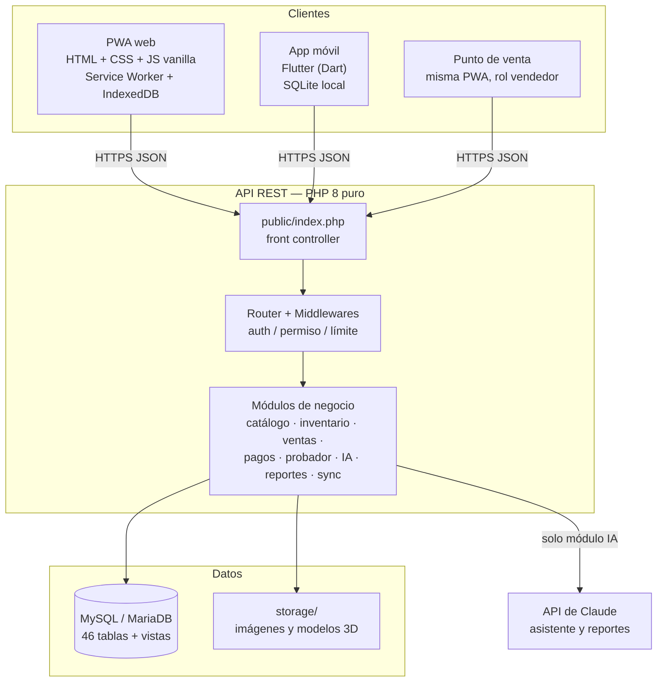
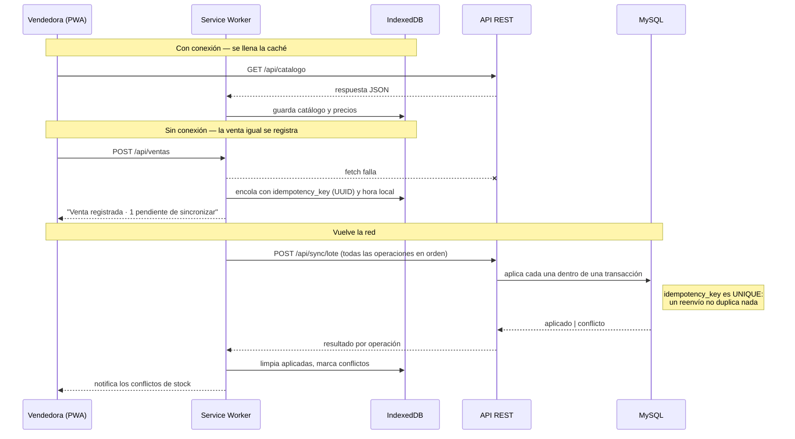
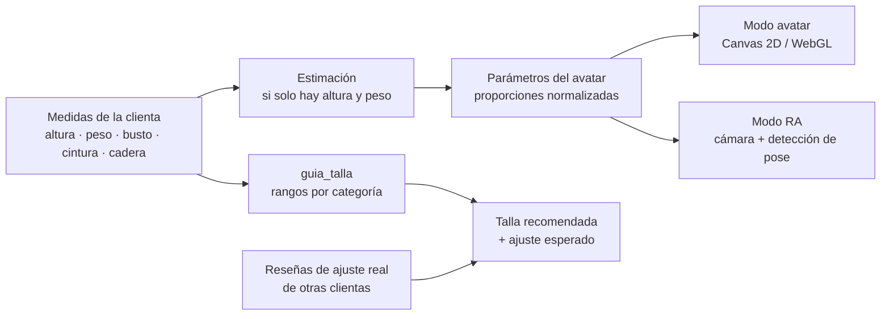
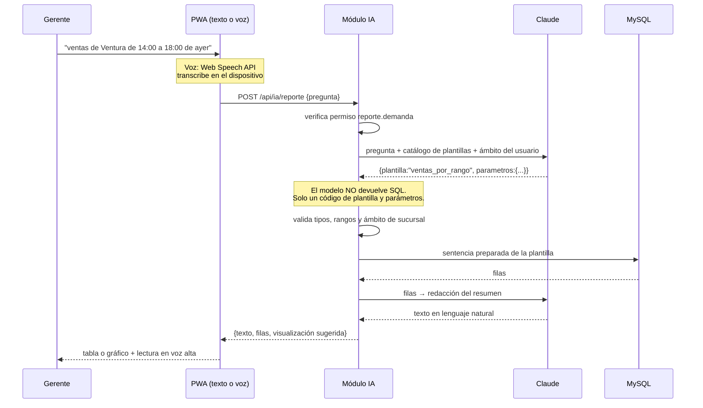

# 4. Arquitectura

## 4.1 Vista general

Tres clientes distintos consumen una sola API REST. No hay lógica de negocio
duplicada en el cliente: el servidor es la única autoridad sobre precios, stock,
permisos y estados.



## 4.2 Decisiones técnicas y su razón

| Decisión | Razón |
|---|---|
| **PHP 8 puro, sin Composer** | El enunciado prohíbe frameworks. Se escribieron a mano el router, el acceso a datos sobre PDO, JWT con HMAC-SHA256, el validador y el RBAC. Cero dependencias externas: `git clone` y funciona. |
| **Front controller único** | Un solo punto de entrada permite aplicar CORS, seguridad, manejo de errores y auditoría en un solo lugar, y deja el contrato HTTP declarado íntegro en `routes.php`. |
| **Autocarga PSR-4 propia** | 20 líneas en `index.php` reemplazan a Composer sin violar la restricción. |
| **Variante como unidad vendible** | En ropa, el stock y el precio no son del producto sino de la combinación producto × talla × color. Modelar la variante evita el error clásico de guardar tallas como texto. |
| **RBAC en base de datos** | Los permisos se consultan, no se compilan. El administrador crea un rol nuevo y le asigna permisos sin tocar código (RF-04). |
| **JWT de acceso + refresh opaco** | El JWT corto se valida sin ir a la base (rápido). El refresh es una cadena aleatoria de la que se guarda solo el hash, revocable y rotatoria: si se filtra, deja de servir al primer uso legítimo. |
| **Plantillas SQL para los reportes de IA** | El modelo nunca escribe SQL. Elige un código de plantilla y devuelve parámetros; el backend valida los parámetros y ejecuta una sentencia preparada. Cierra la puerta a inyección por prompt. |
| **Claves de idempotencia** | Sin ellas, una venta hecha offline que se reintenta al volver la red se registra dos veces. Con ellas, el reintento es inofensivo. |
| **Vistas `v_ventas_detalle` y `v_stock_sucursal`** | Los reportes bajo demanda parten de una base ya normalizada; las plantillas quedan cortas y auditables. |

## 4.3 Capas del backend

```
backend/
├── public/index.php     Front controller: autocarga, CORS, errores, despacho
├── routes.php           Contrato HTTP completo (única fuente de verdad)
├── core/
│   ├── Env.php          Lectura de .env sin librerías
│   ├── DB.php           PDO + transacciones anidadas por SAVEPOINT + correlativos
│   ├── Request.php      Petición normalizada: ruta, cuerpo JSON, cabeceras, paginación
│   ├── Response.php     Forma única de respuesta: {ok, mensaje, datos, meta}
│   ├── Router.php       Patrones /recurso/{id} a regex, grupos y middlewares
│   ├── Middleware.php   auth · opcional · permiso:código · límite:n,seg
│   ├── Auth.php         Login, JWT, refresh, permisos, ámbito por sucursal
│   ├── Jwt.php          HS256 a mano; bloquea alg=none; hash_equals
│   ├── Validator.php    Reglas encadenadas, incluidas existe: y unico:
│   ├── Bitacora.php     Auditoría; oculta campos sensibles; nunca interrumpe
│   ├── HttpException.php Errores con código HTTP correcto
│   └── Controller.php   Base de controladores
└── modules/<Modulo>/    Controlador + servicio de cada área de negocio
```

**Regla de dependencia:** `modules/` conoce `core/`; `core/` nunca conoce
`modules/`. Eso es lo que hace portable el backend: si el docente exige otro
lenguaje, se reescribe `core/` y `modules/`, y el esquema SQL, el contrato REST,
el PWA y la app Flutter quedan intactos.

## 4.4 Estrategia offline

El requisito es que la aplicación **funcione sin internet** — no solo que
muestre una pantalla de error elegante.



**Qué se cachea y cómo**

| Recurso | Estrategia | Motivo |
|---|---|---|
| HTML, CSS, JS, íconos | *Cache first* | El armazón de la app debe abrir instantáneo y sin red |
| Catálogo e imágenes | *Stale while revalidate* | Se muestra lo cacheado y se refresca en segundo plano |
| Stock y precios | *Network first* con respaldo | Son datos que cambian; sin red se usa el último conocido y se marca como tal |
| Ventas, pagos, ajustes | *Cola de salida* en IndexedDB | Se aplican en el servidor cuando vuelve la red |

**Resolución de conflictos.** El servidor es la autoridad. Si al sincronizar una
venta offline el stock ya no alcanza, la operación se marca `conflicto`, no se
aplica, y se devuelve al dispositivo para que el vendedor decida (sustituir
talla, transferir de otro almacén o anular). El caso queda registrado en
`sync_operacion` con su motivo.

**Métodos de pago offline.** Solo los métodos con `disponible_offline = 1`
—efectivo y contra entrega— se ofrecen sin red. Un cobro con QR o tarjeta exige
confirmación del emisor y no puede simularse localmente.

## 4.5 Probador digital y realidad aumentada

Dos modos que comparten el mismo cálculo de talla:



| Modo | Tecnología | Alcance |
|---|---|---|
| **Avatar** | Canvas/WebGL sobre un modelo paramétrico deformado por las medidas | Funciona en cualquier dispositivo, incluso sin cámara. Es el modo por defecto |
| **RA con cámara** | `getUserMedia` + detección de pose en el navegador; la prenda se superpone anclada a hombros, cintura y cadera | Requiere cámara y permiso del usuario. En Flutter, la cámara nativa |

El cálculo de talla no es cosmético: compara cada medida contra los rangos de
`guia_talla` de la categoría, elige la talla que satisface más medidas y devuelve
además el **ajuste esperado** (de −2 «muy ajustada» a +2 «muy holgada»). Ese
valor se corrige con el campo `ajuste_real` que dejan las clientas en sus
reseñas, de modo que la recomendación mejora con el uso.

## 4.6 Asistente de IA

Dos usos del mismo motor, con controles distintos.

**Asistente de compra (cliente).** Recibe la pregunta, busca en el catálogo real
por texto completo y filtros, y responde con productos concretos y enlaces. No
inventa productos: si la búsqueda no devuelve nada, lo dice.

**Reportes bajo demanda (personal).** Este es el punto donde un diseño ingenuo
falla. La ruta segura:



**Controles aplicados**

1. El modelo elige entre plantillas registradas en `plantilla_reporte`; nunca
   redacta SQL.
2. Los parámetros se validan por tipo antes de llegar a la consulta.
3. El ámbito se impone en el servidor: si el usuario no tiene
   `sucursal.ver_todas`, el `sucursal_id` se fuerza al suyo aunque el modelo haya
   pedido otro.
4. Cada plantilla puede exigir un permiso propio.
5. Todo queda en `consulta_reporte`: pregunta, plantilla, parámetros, filas,
   duración y error.
6. Límite de tasa por usuario en los endpoints de IA.

**Voz.** La transcripción usa la Web Speech API en el navegador y
`speech_to_text` en Flutter: el audio no sale del dispositivo, solo el texto. La
respuesta se lee con síntesis de voz local.

## 4.7 Seguridad

| Amenaza | Control |
|---|---|
| Inyección SQL | Sentencias preparadas en el 100 % de las consultas; los reportes de IA además pasan por plantillas cerradas |
| Robo de credenciales | bcrypt costo 12; mensaje de error idéntico para usuario inexistente y contraseña mala |
| Fuerza bruta | Bloqueo de cuenta a los 5 intentos + límite de tasa por IP en login y registro |
| Token robado | Acceso de 1 hora; refresh rotatorio guardado solo como hash, revocable |
| `alg=none` en JWT | El verificador exige explícitamente HS256 y compara con `hash_equals` |
| Escalada de privilegios | Permiso verificado en el servidor en cada ruta; el ámbito de sucursal se fuerza del lado del servidor |
| XSS | Respuestas JSON con escape; el PWA usa `textContent`, nunca `innerHTML` con datos del servidor |
| Fuga por bitácora | `Bitacora` enmascara contraseñas, tokens y payloads de QR |
| Archivos sensibles servidos | `.htaccess` niega `.env`, `.sql`, `.log` dentro del docroot |
| Duplicación por reintento | `idempotency_key UNIQUE` en pedidos, pagos y operaciones de sincronización |

## 4.8 Despliegue

| Componente | Destino | Notas |
|---|---|---|
| API + PWA | Hosting con Apache y PHP 8 (Hostinger) | `public/` como docroot; `.htaccess` ya incluido |
| Base de datos | MySQL/MariaDB del mismo hosting | `schema.sql` y `seed.sql` por phpMyAdmin o CLI |
| App móvil | APK firmado (Android) | `flutter build apk --release`, apuntando a la API de producción |
| Imágenes y modelos 3D | `backend/storage/uploads` | Servidos como archivos estáticos |

Para desarrollo local basta XAMPP: MariaDB para los datos y
`php -S localhost:8000 backend/server.php` para la API.
