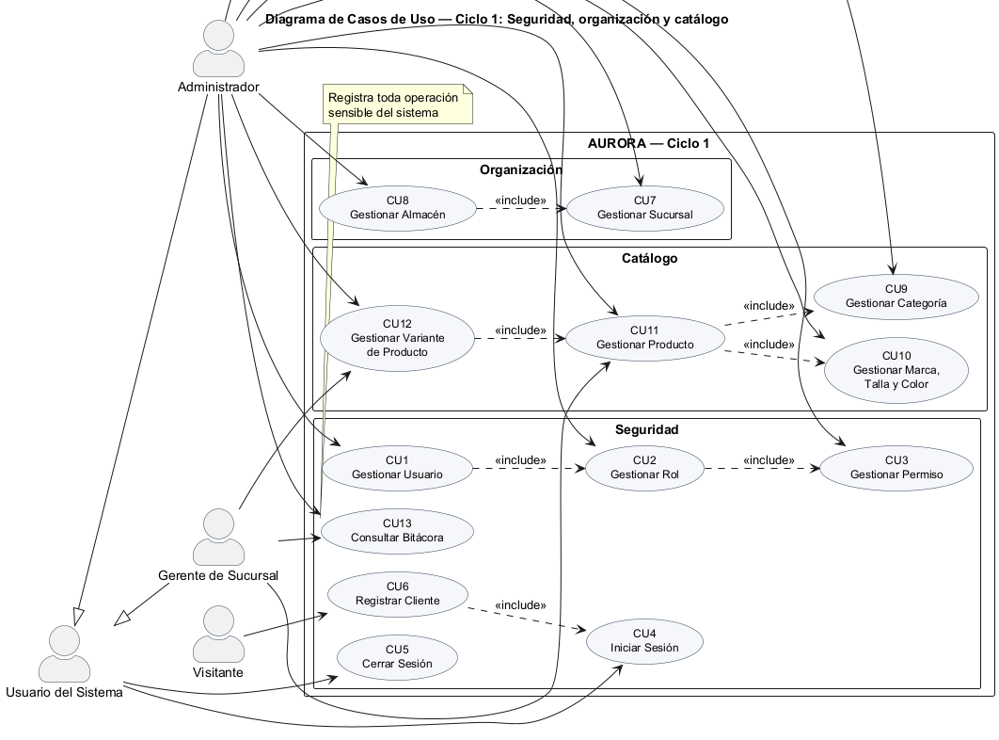
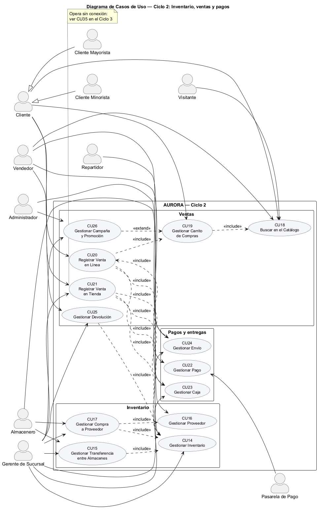
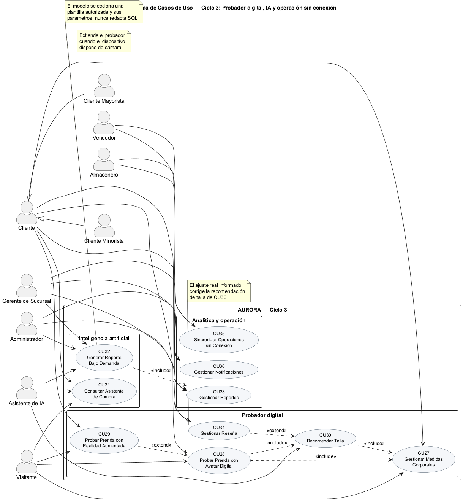

# CAPÍTULO 2. FLUJO DE TRABAJO: CAPTURA DE REQUISITOS

## 2.1. Identificar actores y casos de uso

### 2.1.1. Identificar actores

| ID | ACTOR | DESCRIPCIÓN |
|---|---|---|
| A1 | Administrador (ADM) | Responsable de la configuración global del sistema: usuarios, roles, permisos, estructura territorial, sucursales, almacenes, catálogo y campañas. Accede a la información de toda la red y a la bitácora de auditoría. |
| A2 | Gerente de Sucursal (GER) | Responsable de la operación de una sucursal. Supervisa ventas, existencias, caja y personal de su local, y consulta reportes acotados a su ámbito. |
| A3 | Vendedor (VEN) | Atiende la venta de mostrador, cobra, opera la caja y prepara los pedidos en línea asignados a su sucursal. |
| A4 | Almacenero (ALM) | Administra las existencias de los almacenes de su sucursal: recibe compras, ajusta stock, y despacha y recibe transferencias. |
| A5 | Repartidor (REP) | Recibe los pedidos asignados para entrega a domicilio y registra el resultado de la entrega. |
| A6 | Cliente Minorista (CMI) | Persona registrada que compra al detalle. Usa el probador digital, el asistente de compra y gestiona sus pedidos, reseñas y devoluciones. |
| A7 | Cliente Mayorista (CMA) | Persona o empresa registrada con NIT validado que compra por volumen accediendo a precios escalonados. |
| A8 | Visitante (VIS) | Usuario no registrado. Navega el catálogo, usa el probador digital y consulta al asistente, pero no puede concretar una compra. |
| A9 | Asistente de Inteligencia Artificial (IA) | Actor no humano del sistema. Interpreta consultas en lenguaje natural, responde sobre el catálogo y traduce solicitudes de reporte en consultas parametrizadas autorizadas. |
| A10 | Pasarela de Pago (PAG) | Actor externo. Procesa y confirma los pagos realizados con código QR y con tarjeta. |

### 2.1.2. Identificar casos de uso

| ID | NOMBRE | ENTORNO |
|---|---|---|
| CU1 | Gestionar Usuario | WEB |
| CU2 | Gestionar Rol | WEB |
| CU3 | Gestionar Permiso | WEB |
| CU4 | Iniciar Sesión | WEB, MÓVIL |
| CU5 | Cerrar Sesión | WEB, MÓVIL |
| CU6 | Registrar Cliente | WEB, MÓVIL |
| CU7 | Gestionar Sucursal | WEB |
| CU8 | Gestionar Almacén | WEB |
| CU9 | Gestionar Categoría | WEB |
| CU10 | Gestionar Marca, Talla y Color | WEB |
| CU11 | Gestionar Producto | WEB, MÓVIL (LISTAR) |
| CU12 | Gestionar Variante de Producto | WEB |
| CU13 | Consultar Bitácora | WEB |
| CU14 | Gestionar Inventario | WEB, MÓVIL |
| CU15 | Gestionar Transferencia entre Almacenes | WEB, MÓVIL |
| CU16 | Gestionar Proveedor | WEB |
| CU17 | Gestionar Compra a Proveedor | WEB |
| CU18 | Buscar en el Catálogo | WEB, MÓVIL |
| CU19 | Gestionar Carrito de Compras | WEB, MÓVIL |
| CU20 | Registrar Venta en Línea | WEB, MÓVIL |
| CU21 | Registrar Venta en Tienda | WEB, MÓVIL |
| CU22 | Gestionar Pago | WEB, MÓVIL |
| CU23 | Gestionar Caja | WEB, MÓVIL |
| CU24 | Gestionar Envío | WEB, MÓVIL |
| CU25 | Gestionar Devolución | WEB, MÓVIL (SOLICITAR) |
| CU26 | Gestionar Campaña y Promoción | WEB |
| CU27 | Gestionar Medidas Corporales | WEB, MÓVIL |
| CU28 | Probar Prenda con Avatar Digital | WEB, MÓVIL |
| CU29 | Probar Prenda con Realidad Aumentada | WEB, MÓVIL |
| CU30 | Recomendar Talla | WEB, MÓVIL |
| CU31 | Consultar Asistente de Compra | WEB, MÓVIL |
| CU32 | Generar Reporte Bajo Demanda | WEB, MÓVIL |
| CU33 | Gestionar Reportes | WEB |
| CU34 | Gestionar Reseña | WEB, MÓVIL |
| CU35 | Sincronizar Operaciones sin Conexión | WEB, MÓVIL |
| CU36 | Gestionar Notificaciones | WEB, MÓVIL |

## 2.2. Priorizar casos de uso

| ID | NOMBRE | ACTOR | PRIORIDAD |
|---|---|---|---|
| CU1 | Gestionar Usuario | ADM | ALTA |
| CU2 | Gestionar Rol | ADM | ALTA |
| CU3 | Gestionar Permiso | ADM | ALTA |
| CU4 | Iniciar Sesión | ADM, GER, VEN, ALM, REP, CMI, CMA | ALTA |
| CU5 | Cerrar Sesión | ADM, GER, VEN, ALM, REP, CMI, CMA | MEDIA |
| CU6 | Registrar Cliente | VIS | ALTA |
| CU7 | Gestionar Sucursal | ADM | ALTA |
| CU8 | Gestionar Almacén | ADM | ALTA |
| CU9 | Gestionar Categoría | ADM | ALTA |
| CU10 | Gestionar Marca, Talla y Color | ADM | ALTA |
| CU11 | Gestionar Producto | ADM, GER | ALTA |
| CU12 | Gestionar Variante de Producto | ADM, GER | ALTA |
| CU13 | Consultar Bitácora | ADM, GER | MEDIA |
| CU14 | Gestionar Inventario | ALM, GER | ALTA |
| CU15 | Gestionar Transferencia entre Almacenes | ALM, GER | MEDIA |
| CU16 | Gestionar Proveedor | ADM, GER | MEDIA |
| CU17 | Gestionar Compra a Proveedor | GER, ALM | MEDIA |
| CU18 | Buscar en el Catálogo | VIS, CMI, CMA, VEN | ALTA |
| CU19 | Gestionar Carrito de Compras | CMI, CMA | ALTA |
| CU20 | Registrar Venta en Línea | CMI, CMA | ALTA |
| CU21 | Registrar Venta en Tienda | VEN, GER | ALTA |
| CU22 | Gestionar Pago | CMI, CMA, VEN, PAG | ALTA |
| CU23 | Gestionar Caja | VEN, GER | MEDIA |
| CU24 | Gestionar Envío | GER, VEN, REP | MEDIA |
| CU25 | Gestionar Devolución | CMI, CMA, GER | MEDIA |
| CU26 | Gestionar Campaña y Promoción | ADM, GER | BAJA |
| CU27 | Gestionar Medidas Corporales | CMI, CMA, VIS | ALTA |
| CU28 | Probar Prenda con Avatar Digital | VIS, CMI, CMA | ALTA |
| CU29 | Probar Prenda con Realidad Aumentada | VIS, CMI, CMA | ALTA |
| CU30 | Recomendar Talla | VIS, CMI, CMA, IA | ALTA |
| CU31 | Consultar Asistente de Compra | VIS, CMI, CMA, IA | ALTA |
| CU32 | Generar Reporte Bajo Demanda | ADM, GER, IA | ALTA |
| CU33 | Gestionar Reportes | ADM, GER | MEDIA |
| CU34 | Gestionar Reseña | CMI, CMA, GER | BAJA |
| CU35 | Sincronizar Operaciones sin Conexión | VEN, ALM | ALTA |
| CU36 | Gestionar Notificaciones | ADM, GER, VEN, ALM, CMI, CMA | BAJA |

Los casos de uso se distribuyen en tres ciclos de desarrollo. El criterio de
distribución combina prioridad y dependencia: un ciclo no puede contener un caso
de uso cuya precondición se resuelva en un ciclo posterior.

### Ciclo #1 — Seguridad, organización y catálogo

| ID | NOMBRE | ACTOR | PRIORIDAD |
|---|---|---|---|
| CU1 | Gestionar Usuario | ADM | ALTA |
| CU2 | Gestionar Rol | ADM | ALTA |
| CU3 | Gestionar Permiso | ADM | ALTA |
| CU4 | Iniciar Sesión | Todos los registrados | ALTA |
| CU5 | Cerrar Sesión | Todos los registrados | MEDIA |
| CU6 | Registrar Cliente | VIS | ALTA |
| CU7 | Gestionar Sucursal | ADM | ALTA |
| CU8 | Gestionar Almacén | ADM | ALTA |
| CU9 | Gestionar Categoría | ADM | ALTA |
| CU10 | Gestionar Marca, Talla y Color | ADM | ALTA |
| CU11 | Gestionar Producto | ADM, GER | ALTA |
| CU12 | Gestionar Variante de Producto | ADM, GER | ALTA |
| CU13 | Consultar Bitácora | ADM, GER | MEDIA |

### Ciclo #2 — Inventario, ventas y pagos

| ID | NOMBRE | ACTOR | PRIORIDAD |
|---|---|---|---|
| CU14 | Gestionar Inventario | ALM, GER | ALTA |
| CU15 | Gestionar Transferencia entre Almacenes | ALM, GER | MEDIA |
| CU16 | Gestionar Proveedor | ADM, GER | MEDIA |
| CU17 | Gestionar Compra a Proveedor | GER, ALM | MEDIA |
| CU18 | Buscar en el Catálogo | VIS, CMI, CMA, VEN | ALTA |
| CU19 | Gestionar Carrito de Compras | CMI, CMA | ALTA |
| CU20 | Registrar Venta en Línea | CMI, CMA | ALTA |
| CU21 | Registrar Venta en Tienda | VEN, GER | ALTA |
| CU22 | Gestionar Pago | CMI, CMA, VEN, PAG | ALTA |
| CU23 | Gestionar Caja | VEN, GER | MEDIA |
| CU24 | Gestionar Envío | GER, VEN, REP | MEDIA |
| CU25 | Gestionar Devolución | CMI, CMA, GER | MEDIA |
| CU26 | Gestionar Campaña y Promoción | ADM, GER | BAJA |

### Ciclo #3 — Probador digital, inteligencia artificial y operación sin conexión

| ID | NOMBRE | ACTOR | PRIORIDAD |
|---|---|---|---|
| CU27 | Gestionar Medidas Corporales | CMI, CMA, VIS | ALTA |
| CU28 | Probar Prenda con Avatar Digital | VIS, CMI, CMA | ALTA |
| CU29 | Probar Prenda con Realidad Aumentada | VIS, CMI, CMA | ALTA |
| CU30 | Recomendar Talla | VIS, CMI, CMA, IA | ALTA |
| CU31 | Consultar Asistente de Compra | VIS, CMI, CMA, IA | ALTA |
| CU32 | Generar Reporte Bajo Demanda | ADM, GER, IA | ALTA |
| CU33 | Gestionar Reportes | ADM, GER | MEDIA |
| CU34 | Gestionar Reseña | CMI, CMA, GER | BAJA |
| CU35 | Sincronizar Operaciones sin Conexión | VEN, ALM | ALTA |
| CU36 | Gestionar Notificaciones | Todos | BAJA |

## 2.3. Especificar casos de uso

### Ciclo #1

#### CU1. Gestionar Usuario

| Campo | Contenido |
|---|---|
| **Nombre de CU** | CU1. Gestionar Usuario |
| **Propósito** | Administrar las cuentas del personal de la empresa que accede al sistema. |
| **Actores** | Administrador |
| **Actor iniciador** | Administrador |
| **Precondición** | CU2. Gestionar Rol · CU7. Gestionar Sucursal |
| **Flujo principal** | **Obtener usuarios** · Listar todos los usuarios · Filtrar por rol, sucursal y estado · Visualizar el detalle de un usuario **Registrar usuario** · Ingresar nombre, apellido, correo, teléfono y cédula · Asignar un rol · Asignar una sucursal cuando el rol lo requiere · Generar la contraseña inicial **Modificar usuario** · Buscar el usuario existente · Obtener sus datos actuales · Actualizar los datos y el rol asignado **Dar de baja usuario** · Buscar el usuario activo · Deshabilitar la cuenta y revocar sus sesiones |
| **Postcondición** | El usuario queda registrado, modificado o deshabilitado, y la operación se registra en la bitácora. |
| **Excepción** | El correo ya está registrado. La contraseña no alcanza la longitud mínima de ocho caracteres. El correo no tiene formato válido. El rol asignado exige sucursal y no se indicó ninguna. No se puede deshabilitar la propia cuenta. |

#### CU2. Gestionar Rol

| Campo | Contenido |
|---|---|
| **Nombre de CU** | CU2. Gestionar Rol |
| **Propósito** | Definir los roles del sistema y el conjunto de permisos que cada uno otorga. |
| **Actores** | Administrador |
| **Actor iniciador** | Administrador |
| **Precondición** | CU3. Gestionar Permiso |
| **Flujo principal** | **Obtener roles** · Listar los roles con la cantidad de usuarios asignados **Registrar rol** · Ingresar nombre y descripción · Seleccionar los permisos que otorga **Modificar rol** · Buscar el rol existente · Actualizar su descripción · Agregar o quitar permisos **Dar de baja rol** · Buscar el rol · Deshabilitarlo |
| **Postcondición** | El rol queda registrado con sus permisos, y los usuarios que lo tienen asignado ven modificados sus privilegios en su siguiente petición. |
| **Excepción** | Ya existe un rol con ese nombre. No se puede eliminar un rol asignado a usuarios activos. No se pueden eliminar ni renombrar los roles del sistema. |

#### CU3. Gestionar Permiso

| Campo | Contenido |
|---|---|
| **Nombre de CU** | CU3. Gestionar Permiso |
| **Propósito** | Mantener el catálogo de permisos que controlan el acceso a cada operación del sistema. |
| **Actores** | Administrador |
| **Actor iniciador** | Administrador |
| **Precondición** | CU4. Iniciar Sesión con una cuenta administradora |
| **Flujo principal** | **Obtener permisos** · Listar los permisos agrupados por módulo · Consultar qué roles poseen un permiso **Registrar permiso** · Ingresar el código en formato módulo.acción · Ingresar el módulo y la descripción **Modificar permiso** · Buscar el permiso · Actualizar su descripción **Eliminar permiso** · Buscar el permiso · Eliminarlo junto con sus asignaciones a roles |
| **Postcondición** | El catálogo de permisos queda actualizado y las verificaciones de autorización lo reflejan de inmediato. |
| **Excepción** | El código de permiso ya existe. El código no respeta el formato módulo.acción. No se puede eliminar el permiso comodín del sistema. |

#### CU4. Iniciar Sesión

| Campo | Contenido |
|---|---|
| **Nombre de CU** | CU4. Iniciar Sesión |
| **Propósito** | Autenticar al usuario y entregarle las credenciales de acceso al sistema. |
| **Actores** | Administrador, Gerente, Vendedor, Almacenero, Repartidor, Cliente Minorista, Cliente Mayorista |
| **Actor iniciador** | El propio usuario |
| **Precondición** | El usuario está registrado y su cuenta se encuentra activa. |
| **Flujo principal** | · Ingresar correo electrónico y contraseña · Verificar que la cuenta no esté bloqueada temporalmente · Verificar las credenciales contra el resumen criptográfico almacenado · Registrar el dispositivo cuando la petición lo identifica · Emitir el token de acceso y el token de refresco · Devolver el perfil del usuario junto con sus permisos · Reiniciar el contador de intentos fallidos y registrar el último acceso |
| **Postcondición** | El usuario obtiene un token de acceso vigente por una hora y un token de refresco vigente por treinta días. El ingreso queda registrado en la bitácora. |
| **Excepción** | Las credenciales son incorrectas; el sistema responde con un mensaje idéntico tanto si el correo no existe como si la contraseña es errónea. La cuenta acumuló cinco intentos fallidos y queda bloqueada por quince minutos. La cuenta está desactivada. |

#### CU5. Cerrar Sesión

| Campo | Contenido |
|---|---|
| **Nombre de CU** | CU5. Cerrar Sesión |
| **Propósito** | Finalizar la sesión del usuario e invalidar sus credenciales de refresco. |
| **Actores** | Todos los usuarios registrados |
| **Actor iniciador** | El propio usuario |
| **Precondición** | CU4. Iniciar Sesión |
| **Flujo principal** | · Solicitar el cierre de sesión enviando el token de refresco · Revocar el token de refresco en el servidor · Descartar las credenciales almacenadas en el dispositivo · Conservar las operaciones aún pendientes de sincronización |
| **Postcondición** | El token de refresco queda revocado y no puede reutilizarse. El cierre queda registrado en la bitácora. |
| **Excepción** | El token de refresco ya estaba revocado o expirado; la operación se considera exitosa de todos modos. |

#### CU6. Registrar Cliente

| Campo | Contenido |
|---|---|
| **Nombre de CU** | CU6. Registrar Cliente |
| **Propósito** | Permitir que un visitante cree su cuenta para poder comprar en la tienda en línea. |
| **Actores** | Visitante |
| **Actor iniciador** | Visitante |
| **Precondición** | Ninguna |
| **Flujo principal** | · Seleccionar el tipo de cuenta: minorista o mayorista · Ingresar nombre, apellido, correo, teléfono y contraseña · Ingresar NIT y razón social cuando la cuenta es mayorista · Aceptar los términos del servicio · Crear la cuenta con el rol cliente · Emitir los tokens de acceso e iniciar sesión automáticamente |
| **Postcondición** | La cuenta queda creada. Una cuenta mayorista queda pendiente de aprobación y opera con precios minoristas hasta que un administrador valide su NIT. |
| **Excepción** | El correo ya está registrado. La contraseña no alcanza los ocho caracteres. Se eligió cuenta mayorista sin informar el NIT. |

#### CU7. Gestionar Sucursal

| Campo | Contenido |
|---|---|
| **Nombre de CU** | CU7. Gestionar Sucursal |
| **Propósito** | Administrar la red de sucursales de la cadena y su ubicación geográfica. |
| **Actores** | Administrador |
| **Actor iniciador** | Administrador |
| **Precondición** | Existe la estructura territorial de departamentos y ciudades. |
| **Flujo principal** | **Obtener sucursales** · Listar las sucursales agrupadas por departamento · Visualizar el detalle de una sucursal **Registrar sucursal** · Ingresar código, nombre, ciudad, dirección, teléfono y horario · Registrar las coordenadas geográficas · Indicar si es un centro de distribución que sólo atiende pedidos en línea **Modificar sucursal** · Buscar la sucursal y actualizar sus datos **Dar de baja sucursal** · Deshabilitar la sucursal |
| **Postcondición** | La sucursal queda registrada y disponible para asignarle almacenes, personal y ventas. |
| **Excepción** | El código de sucursal ya existe. No se puede dar de baja una sucursal con existencias o pedidos pendientes. |

#### CU8. Gestionar Almacén

| Campo | Contenido |
|---|---|
| **Nombre de CU** | CU8. Gestionar Almacén |
| **Propósito** | Administrar los almacenes que operan dentro de cada sucursal. |
| **Actores** | Administrador |
| **Actor iniciador** | Administrador |
| **Precondición** | CU7. Gestionar Sucursal |
| **Flujo principal** | **Obtener almacenes** · Listar los almacenes de una sucursal **Registrar almacén** · Seleccionar la sucursal a la que pertenece · Ingresar código y nombre · Seleccionar el tipo: piso de venta, depósito, devoluciones o tránsito · Marcarlo como almacén principal cuando corresponda **Modificar almacén** · Buscar el almacén y actualizar sus datos **Dar de baja almacén** · Deshabilitar el almacén |
| **Postcondición** | El almacén queda disponible para recibir existencias, atender ventas y participar en transferencias. |
| **Excepción** | El código de almacén ya existe. Una sucursal no puede tener dos almacenes principales. No se puede dar de baja un almacén con existencias distintas de cero. |

#### CU9. Gestionar Categoría

| Campo | Contenido |
|---|---|
| **Nombre de CU** | CU9. Gestionar Categoría |
| **Propósito** | Organizar el catálogo en una jerarquía de categorías y subcategorías. |
| **Actores** | Administrador |
| **Actor iniciador** | Administrador |
| **Precondición** | Ninguna |
| **Flujo principal** | **Obtener categorías** · Listar la jerarquía completa en forma de árbol **Registrar categoría** · Ingresar nombre e imagen · Seleccionar la categoría padre cuando corresponda · Definir el orden de presentación · Generar el identificador legible a partir del nombre **Modificar categoría** · Buscar la categoría y actualizar sus datos o su categoría padre **Dar de baja categoría** · Deshabilitar la categoría |
| **Postcondición** | La jerarquía de categorías queda actualizada y disponible para clasificar productos y para la guía de tallas. |
| **Excepción** | El identificador legible ya existe. No se puede asignar una categoría como padre de sí misma ni de un ancestro suyo. No se puede dar de baja una categoría con productos activos. |

#### CU10. Gestionar Marca, Talla y Color

| Campo | Contenido |
|---|---|
| **Nombre de CU** | CU10. Gestionar Marca, Talla y Color |
| **Propósito** | Mantener los catálogos auxiliares que definen las variantes de un producto. |
| **Actores** | Administrador |
| **Actor iniciador** | Administrador |
| **Precondición** | Ninguna |
| **Flujo principal** | **Gestionar marcas** · Listar, registrar, modificar y dar de baja marcas con su logotipo **Gestionar tallas** · Listar, registrar y modificar tallas indicando su tipo —alfabética, numérica, de calzado o única— y su orden **Gestionar colores** · Listar, registrar y modificar colores con su código hexadecimal **Gestionar guía de tallas** · Definir para cada categoría y talla los rangos de busto, cintura, cadera y estatura |
| **Postcondición** | Los catálogos quedan disponibles para generar variantes de producto y para el cálculo de talla recomendada del probador. |
| **Excepción** | Ya existe una marca, talla o color con ese nombre. El código de color no respeta el formato hexadecimal. Los rangos de la guía de tallas se solapan dentro de una misma categoría. |

#### CU11. Gestionar Producto

| Campo | Contenido |
|---|---|
| **Nombre de CU** | CU11. Gestionar Producto |
| **Propósito** | Administrar las prendas del catálogo y su información descriptiva. |
| **Actores** | Administrador, Gerente de Sucursal |
| **Actor iniciador** | Administrador |
| **Precondición** | CU9. Gestionar Categoría · CU10. Gestionar Marca, Talla y Color |
| **Flujo principal** | **Obtener productos** · Listar productos con filtros por categoría, marca y estado · Visualizar el detalle con sus variantes e imágenes **Registrar producto** · Ingresar código, nombre y descripción · Seleccionar categoría, marca, tipo de prenda y temporada · Ingresar material e instrucciones de cuidado · Cargar las imágenes y asociarlas a un color · Cargar los recursos tridimensionales para el probador **Modificar producto** · Buscar el producto y actualizar sus datos e imágenes **Dar de baja producto** · Deshabilitar el producto y sus variantes |
| **Postcondición** | El producto queda publicado en el catálogo y disponible para generar variantes y para ser encontrado por el buscador. |
| **Excepción** | El código de producto ya existe. La imagen supera el tamaño permitido o tiene un formato no admitido. No se puede dar de baja un producto con existencias o con pedidos en curso. |

#### CU12. Gestionar Variante de Producto

| Campo | Contenido |
|---|---|
| **Nombre de CU** | CU12. Gestionar Variante de Producto |
| **Propósito** | Definir las unidades vendibles de un producto como combinación de talla y color, con su precio y codificación propia. |
| **Actores** | Administrador, Gerente de Sucursal |
| **Actor iniciador** | Administrador |
| **Precondición** | CU11. Gestionar Producto |
| **Flujo principal** | **Obtener variantes** · Listar las variantes de un producto con su existencia consolidada **Generar variantes** · Seleccionar el conjunto de tallas y el conjunto de colores · Generar automáticamente todas las combinaciones · Asignar a cada una su código y su código de barras **Registrar precios** · Ingresar precio minorista, precio mayorista y costo · Definir las escalas de precio por cantidad para venta al por mayor **Modificar variante** · Actualizar precios, peso y código de barras **Dar de baja variante** · Deshabilitar la variante |
| **Postcondición** | Las variantes quedan disponibles para recibir existencias, ser vendidas y ser probadas virtualmente. |
| **Excepción** | Ya existe una variante con la misma combinación de producto, talla y color. El código de barras ya está asignado a otra variante. El precio mayorista es mayor que el precio minorista. Una escala de precio tiene una cantidad mínima menor o igual a otra ya definida. |

#### CU13. Consultar Bitácora

| Campo | Contenido |
|---|---|
| **Nombre de CU** | CU13. Consultar Bitácora |
| **Propósito** | Auditar las operaciones realizadas en el sistema para efectos de control y trazabilidad. |
| **Actores** | Administrador, Gerente de Sucursal |
| **Actor iniciador** | Administrador |
| **Precondición** | CU4. Iniciar Sesión con el permiso de consulta de bitácora |
| **Flujo principal** | · Listar los registros ordenados por fecha descendente · Filtrar por usuario, módulo, acción, entidad y rango de fechas · Visualizar el detalle de un registro con sus valores previos y resultantes · Exportar el resultado de la consulta |
| **Postcondición** | El auditor obtiene la traza de las operaciones realizadas, con usuario, dirección de red y agente responsable. |
| **Excepción** | El usuario no posee el permiso de consulta. El rango de fechas solicitado excede el máximo permitido por consulta. |

### Ciclo #2

#### CU14. Gestionar Inventario

| Campo | Contenido |
|---|---|
| **Nombre de CU** | CU14. Gestionar Inventario |
| **Propósito** | Controlar las existencias de cada variante en cada almacén y registrar sus movimientos. |
| **Actores** | Almacenero, Gerente de Sucursal |
| **Actor iniciador** | Almacenero |
| **Precondición** | CU8. Gestionar Almacén · CU12. Gestionar Variante de Producto |
| **Flujo principal** | **Consultar existencias** · Listar el stock por almacén, con existencia física, reservada y disponible · Consultar la disponibilidad consolidada de una variante en toda la red · Listar las variantes con existencia bajo el mínimo **Ajustar existencias** · Seleccionar la variante y el almacén · Ingresar la nueva cantidad y el motivo del ajuste · Registrar el movimiento con la existencia resultante **Definir existencia mínima** · Establecer el umbral de alerta por variante y almacén **Consultar movimientos** · Listar el historial de movimientos de una variante con su documento de referencia |
| **Postcondición** | Las existencias quedan actualizadas y todo cambio queda registrado como movimiento con su responsable y su motivo. |
| **Excepción** | El ajuste dejaría la existencia en un valor negativo. El ajuste dejaría la existencia por debajo de la cantidad ya reservada. El usuario no tiene alcance sobre el almacén indicado. |

#### CU15. Gestionar Transferencia entre Almacenes

| Campo | Contenido |
|---|---|
| **Nombre de CU** | CU15. Gestionar Transferencia entre Almacenes |
| **Propósito** | Trasladar mercadería entre almacenes de la red para equilibrar existencias y atender quiebres de stock. |
| **Actores** | Almacenero, Gerente de Sucursal |
| **Actor iniciador** | Almacenero |
| **Precondición** | CU14. Gestionar Inventario |
| **Flujo principal** | **Solicitar transferencia** · Seleccionar almacén de origen y almacén de destino · Agregar las variantes y cantidades requeridas · Registrar la solicitud con su número correlativo **Aprobar transferencia** · Revisar la solicitud y verificar la disponibilidad en el origen · Aprobar o rechazar indicando el motivo **Despachar transferencia** · Descontar las existencias del almacén de origen · Marcar la transferencia en tránsito **Recibir transferencia** · Registrar las cantidades efectivamente recibidas · Incrementar las existencias del almacén de destino · Registrar la diferencia cuando la cantidad recibida no coincide |
| **Postcondición** | Las existencias se descuentan del origen y se incrementan en el destino, con dos movimientos de inventario enlazados a la transferencia. |
| **Excepción** | El almacén de origen no tiene existencia disponible suficiente. El almacén de origen y el de destino son el mismo. Se intenta recibir una transferencia que no fue despachada. La cantidad recibida supera la cantidad despachada. |

#### CU16. Gestionar Proveedor

| Campo | Contenido |
|---|---|
| **Nombre de CU** | CU16. Gestionar Proveedor |
| **Propósito** | Mantener el registro de los proveedores que abastecen a la cadena. |
| **Actores** | Administrador, Gerente de Sucursal |
| **Actor iniciador** | Administrador |
| **Precondición** | Ninguna |
| **Flujo principal** | **Obtener proveedores** · Listar proveedores con su estado **Registrar proveedor** · Ingresar nombre, NIT, contacto, teléfono, correo y dirección **Modificar proveedor** · Buscar el proveedor y actualizar sus datos **Dar de baja proveedor** · Deshabilitar el proveedor |
| **Postcondición** | El proveedor queda disponible para ser referenciado en órdenes de compra. |
| **Excepción** | Ya existe un proveedor con ese NIT. No se puede dar de baja un proveedor con compras en estado borrador o confirmado. |

#### CU17. Gestionar Compra a Proveedor

| Campo | Contenido |
|---|---|
| **Nombre de CU** | CU17. Gestionar Compra a Proveedor |
| **Propósito** | Registrar el abastecimiento de mercadería y su ingreso a los almacenes. |
| **Actores** | Gerente de Sucursal, Almacenero |
| **Actor iniciador** | Gerente de Sucursal |
| **Precondición** | CU16. Gestionar Proveedor · CU12. Gestionar Variante de Producto |
| **Flujo principal** | **Registrar compra** · Seleccionar el proveedor y el almacén de destino · Agregar las variantes con cantidad y costo unitario · Calcular el subtotal, el descuento y el total · Guardar la compra en estado borrador **Confirmar compra** · Revisar el detalle y confirmar la orden **Recibir mercadería** · Registrar las cantidades recibidas · Incrementar las existencias del almacén de destino · Actualizar el costo de las variantes recibidas **Anular compra** · Anular la compra revirtiendo los movimientos generados |
| **Postcondición** | Las existencias del almacén se incrementan y se genera un movimiento de entrada por cada variante recibida. |
| **Excepción** | La compra no tiene ninguna línea de detalle. Se intenta recibir una compra que no fue confirmada. Se intenta anular una compra ya recibida cuya mercadería fue vendida. |

#### CU18. Buscar en el Catálogo

| Campo | Contenido |
|---|---|
| **Nombre de CU** | CU18. Buscar en el Catálogo |
| **Propósito** | Permitir que el usuario encuentre prendas mediante distintos mecanismos de búsqueda. |
| **Actores** | Visitante, Cliente Minorista, Cliente Mayorista, Vendedor |
| **Actor iniciador** | Visitante |
| **Precondición** | CU11. Gestionar Producto |
| **Flujo principal** | · Buscar por texto libre sobre nombre, descripción y material · Navegar por la jerarquía de categorías · Filtrar por marca, talla, color, rango de precio y temporada · Filtrar por disponibilidad en una sucursal determinada · Ordenar por relevancia, precio ascendente o descendente, novedad, más vendidos o mejor calificados · Paginar el resultado · Visualizar la ficha del producto con galería, variantes disponibles, existencia por sucursal y reseñas · Buscar por código de barras cuando el actor es un vendedor |
| **Postcondición** | El usuario obtiene el conjunto de productos que satisfacen sus criterios, con su disponibilidad real. |
| **Excepción** | La búsqueda no arroja resultados; el sistema sugiere criterios alternativos. Sin conexión, se responde con el catálogo almacenado localmente indicando la fecha de su última actualización. |

#### CU19. Gestionar Carrito de Compras

| Campo | Contenido |
|---|---|
| **Nombre de CU** | CU19. Gestionar Carrito de Compras |
| **Propósito** | Reunir las prendas que el cliente pretende adquirir y calcular el importe aplicable. |
| **Actores** | Cliente Minorista, Cliente Mayorista, Visitante |
| **Actor iniciador** | Cliente |
| **Precondición** | CU18. Buscar en el Catálogo |
| **Flujo principal** | · Agregar una variante al carrito indicando la cantidad · Determinar el precio aplicable según el tipo de cliente y la cantidad · Modificar la cantidad de una línea · Quitar una línea del carrito · Vaciar el carrito · Calcular subtotal, descuento por promoción y total · Aplicar un cupón de descuento · Fusionar el carrito de visitante con el del cliente al iniciar sesión |
| **Postcondición** | El carrito refleja las prendas elegidas con el precio correcto según la modalidad de compra. |
| **Excepción** | La cantidad solicitada supera la existencia disponible. La variante fue dada de baja mientras estaba en el carrito. El cupón no existe, expiró, agotó sus usos o no alcanza el importe mínimo. Un cliente mayorista sin aprobación recibe precios minoristas. |

#### CU20. Registrar Venta en Línea

| Campo | Contenido |
|---|---|
| **Nombre de CU** | CU20. Registrar Venta en Línea |
| **Propósito** | Convertir el carrito del cliente en un pedido confirmado a través del canal digital. |
| **Actores** | Cliente Minorista, Cliente Mayorista |
| **Actor iniciador** | Cliente |
| **Precondición** | CU19. Gestionar Carrito de Compras · CU4. Iniciar Sesión |
| **Flujo principal** | · Revisar el resumen del carrito · Seleccionar la modalidad de entrega: retiro en tienda o envío a domicilio · Seleccionar o registrar la dirección de envío · Seleccionar la sucursal de retiro cuando corresponde · Determinar el almacén que atenderá el pedido · Calcular el costo de envío · Seleccionar el método de pago · Confirmar el pedido generando su número correlativo · Reservar la existencia de cada variante · Registrar el estado inicial en el historial del pedido · Notificar al cliente y a la sucursal asignada |
| **Postcondición** | El pedido queda registrado en estado pendiente con la existencia reservada, a la espera de la confirmación del pago. |
| **Excepción** | Alguna variante ya no tiene existencia disponible suficiente. El carrito está vacío. No se indicó dirección de envío para una entrega a domicilio. El cliente mayorista no alcanza el importe mínimo de compra por volumen. Se reenvió un pedido con la misma clave de idempotencia; se devuelve el pedido original sin duplicarlo. |

#### CU21. Registrar Venta en Tienda

| Campo | Contenido |
|---|---|
| **Nombre de CU** | CU21. Registrar Venta en Tienda |
| **Propósito** | Registrar una venta de mostrador con entrega inmediata de la mercadería. |
| **Actores** | Vendedor, Gerente de Sucursal |
| **Actor iniciador** | Vendedor |
| **Precondición** | CU23. Gestionar Caja con caja abierta · CU14. Gestionar Inventario |
| **Flujo principal** | · Agregar prendas buscándolas por código de barras, código o nombre · Ajustar cantidades · Identificar al cliente de manera opcional para acumular su historial · Aplicar promociones vigentes · Calcular el total · Seleccionar el método de pago y registrar el cobro · Descontar la existencia del almacén principal de la sucursal · Generar el comprobante de venta · Registrar el movimiento de caja |
| **Postcondición** | La venta queda registrada en estado pagado, la existencia descontada y el movimiento de caja asentado. |
| **Excepción** | No hay caja abierta para el vendedor. La existencia disponible es insuficiente; el sistema ofrece consultar otras sucursales. Sin conexión, la venta se registra localmente y se encola para sincronizar, admitiendo únicamente los métodos de pago habilitados para operación fuera de línea. |

#### CU22. Gestionar Pago

| Campo | Contenido |
|---|---|
| **Nombre de CU** | CU22. Gestionar Pago |
| **Propósito** | Registrar y confirmar los pagos asociados a un pedido, cualquiera sea su método. |
| **Actores** | Cliente Minorista, Cliente Mayorista, Vendedor, Gerente de Sucursal, Pasarela de Pago |
| **Actor iniciador** | Cliente o Vendedor |
| **Precondición** | CU20. Registrar Venta en Línea o CU21. Registrar Venta en Tienda |
| **Flujo principal** | · Seleccionar el método de pago entre los habilitados para el canal · **Efectivo:** registrar el importe recibido y calcular el cambio · **Código QR:** generar el código, presentarlo y esperar la confirmación de la pasarela · **Tarjeta:** derivar a la pasarela y recibir su respuesta · **Transferencia:** cargar el comprobante para su validación posterior · **Contra entrega:** registrar el compromiso de cobro al momento de la entrega · Confirmar el pago y actualizar el estado del pedido a pagado · Convertir la reserva de existencia en descuento efectivo · Registrar el movimiento de caja cuando el cobro es en mostrador |
| **Postcondición** | El pago queda registrado con su estado, y el pedido avanza a preparación cuando el pago se confirma. |
| **Excepción** | La pasarela rechaza la operación. El importe pagado no coincide con el total del pedido. El comprobante cargado no es legible o corresponde a otro importe. Se reintentó un pago con la misma clave de idempotencia; se devuelve el pago original. |

#### CU23. Gestionar Caja

| Campo | Contenido |
|---|---|
| **Nombre de CU** | CU23. Gestionar Caja |
| **Propósito** | Controlar el efectivo de cada turno de venta en la sucursal. |
| **Actores** | Vendedor, Gerente de Sucursal |
| **Actor iniciador** | Vendedor |
| **Precondición** | CU4. Iniciar Sesión con el permiso de operación de caja |
| **Flujo principal** | **Abrir caja** · Registrar el monto de apertura **Registrar movimientos** · Asentar los ingresos por cobros en efectivo · Asentar los egresos por gastos o retiros con su concepto **Cerrar caja** · Calcular el monto esperado a partir de los movimientos · Registrar el monto contado físicamente · Calcular y registrar la diferencia **Consultar cajas** · Listar el historial de cajas por sucursal, usuario y fecha |
| **Postcondición** | La caja queda cerrada con su arqueo, y la diferencia queda registrada para su revisión. |
| **Excepción** | El vendedor ya tiene una caja abierta. Se intenta cerrar una caja con pedidos pendientes de cobro. El monto contado difiere del esperado; se exige registrar una justificación. |

#### CU24. Gestionar Envío

| Campo | Contenido |
|---|---|
| **Nombre de CU** | CU24. Gestionar Envío |
| **Propósito** | Administrar la preparación, el despacho y la entrega de los pedidos a domicilio. |
| **Actores** | Gerente de Sucursal, Vendedor, Repartidor |
| **Actor iniciador** | Gerente de Sucursal |
| **Precondición** | CU20. Registrar Venta en Línea con pago confirmado |
| **Flujo principal** | · Listar los pedidos pendientes de preparación en la sucursal · Preparar el pedido y marcarlo como listo · Asignar un repartidor o una empresa de transporte · Registrar el número de seguimiento y la fecha estimada · Marcar el pedido como despachado · Registrar la entrega con su evidencia · Registrar el intento fallido y su motivo cuando la entrega no se concreta · Notificar al cliente en cada cambio de estado |
| **Postcondición** | El pedido queda entregado y su historial refleja cada transición de estado. |
| **Excepción** | El pedido no tiene el pago confirmado y el método no es contra entrega. La entrega falla de manera reiterada y el pedido se deriva a devolución. El repartidor asignado no pertenece a la sucursal del pedido. |

#### CU25. Gestionar Devolución

| Campo | Contenido |
|---|---|
| **Nombre de CU** | CU25. Gestionar Devolución |
| **Propósito** | Procesar la devolución de prendas y el reembolso correspondiente. |
| **Actores** | Cliente Minorista, Cliente Mayorista, Gerente de Sucursal |
| **Actor iniciador** | Cliente |
| **Precondición** | CU24. Gestionar Envío o CU21. Registrar Venta en Tienda, con pedido entregado |
| **Flujo principal** | **Solicitar devolución** · Seleccionar el pedido y las prendas a devolver · Indicar el motivo: talla incorrecta, defecto, no coincide con lo publicado u otro · Adjuntar evidencia fotográfica **Evaluar devolución** · Revisar la solicitud y aprobarla o rechazarla **Recibir mercadería** · Registrar el estado de cada prenda devuelta · Reingresar a existencias únicamente las prendas en estado nuevo **Reembolsar** · Calcular el importe a reembolsar · Registrar el reembolso y cerrar la devolución |
| **Postcondición** | La devolución queda cerrada, las prendas aptas reingresan al almacén de devoluciones y el reembolso queda registrado. |
| **Excepción** | El plazo de devolución venció. El pedido no está en estado entregado. La cantidad a devolver supera la cantidad comprada. La prenda vuelve dañada o usada y no reingresa a existencias. |

#### CU26. Gestionar Campaña y Promoción

| Campo | Contenido |
|---|---|
| **Nombre de CU** | CU26. Gestionar Campaña y Promoción |
| **Propósito** | Definir las acciones comerciales de temporada y los descuentos aplicables. |
| **Actores** | Administrador, Gerente de Sucursal |
| **Actor iniciador** | Administrador |
| **Precondición** | CU11. Gestionar Producto |
| **Flujo principal** | **Gestionar campañas** · Registrar nombre, tipo, imagen y vigencia de la campaña **Gestionar promociones** · Seleccionar el tipo: porcentaje, monto fijo, dos por uno o envío gratuito · Definir el valor y el importe mínimo de compra · Definir el alcance: todo el catálogo, una categoría, un producto o una variante · Restringir por canal y por modalidad de compra · Generar el código de cupón y definir su tope de usos · Establecer la vigencia **Consultar aplicación** · Listar los pedidos en que se aplicó cada promoción |
| **Postcondición** | La promoción queda vigente y se aplica automáticamente a los pedidos que cumplen sus condiciones. |
| **Excepción** | La fecha de fin es anterior a la de inicio. El código de cupón ya existe. El descuento por porcentaje excede el cien por ciento. La promoción dejaría el precio por debajo del costo. |

### Ciclo #3

#### CU27. Gestionar Medidas Corporales

| Campo | Contenido |
|---|---|
| **Nombre de CU** | CU27. Gestionar Medidas Corporales |
| **Propósito** | Capturar las medidas de la clienta que alimentan el probador digital y la recomendación de talla. |
| **Actores** | Cliente Minorista, Cliente Mayorista, Visitante |
| **Actor iniciador** | Cliente |
| **Precondición** | Ninguna |
| **Flujo principal** | · Ingresar estatura y peso como datos mínimos · Ingresar de manera opcional busto, cintura, cadera, entrepierna y hombro · Estimar las medidas no informadas a partir de la estatura y el peso · Registrar el origen de cada medida: manual o estimada · Clasificar el tipo de cuerpo a partir de las proporciones · Generar los parámetros del modelo corporal · Actualizar las medidas cuando la clienta lo solicite · Conservar las medidas de un visitante en el dispositivo hasta que se registre |
| **Postcondición** | Las medidas quedan asociadas a la clienta y disponibles para el probador y la recomendación de talla. |
| **Excepción** | La estatura o el peso están fuera de un rango fisiológicamente admisible. Las medidas informadas son inconsistentes entre sí. No se informaron ni la estatura ni el peso. |

#### CU28. Probar Prenda con Avatar Digital

| Campo | Contenido |
|---|---|
| **Nombre de CU** | CU28. Probar Prenda con Avatar Digital |
| **Propósito** | Permitir que la clienta vea cómo luce una prenda sobre un modelo corporal construido con sus propias medidas. |
| **Actores** | Visitante, Cliente Minorista, Cliente Mayorista |
| **Actor iniciador** | Cliente |
| **Precondición** | CU27. Gestionar Medidas Corporales · CU12. Gestionar Variante de Producto con recurso tridimensional cargado |
| **Flujo principal** | · Seleccionar el producto y abrir el probador · Construir el modelo corporal deformando el modelo paramétrico según las medidas · Seleccionar la talla y el color a probar · Renderizar la prenda sobre el modelo respetando su textura y su color · Ejecutar CU30 para obtener la talla recomendada · Rotar y acercar el modelo · Cambiar de talla o de color sin salir del probador · Superponer una segunda prenda para componer un conjunto · Guardar una captura de la prueba · Registrar la prueba virtual y su duración |
| **Postcondición** | La prueba queda registrada, la clienta conoce el aspecto y el calce esperado de la prenda, y puede agregarla al carrito desde el propio probador. |
| **Excepción** | La clienta no registró sus medidas; el sistema le solicita al menos estatura y peso. El producto no cuenta con recurso tridimensional; se ofrece la vista fotográfica con la talla recomendada. El dispositivo no soporta la aceleración gráfica requerida; se degrada a una representación bidimensional. |

#### CU29. Probar Prenda con Realidad Aumentada

| Campo | Contenido |
|---|---|
| **Nombre de CU** | CU29. Probar Prenda con Realidad Aumentada |
| **Propósito** | Superponer la prenda seleccionada sobre la imagen real de la clienta captada por la cámara del dispositivo. |
| **Actores** | Visitante, Cliente Minorista, Cliente Mayorista |
| **Actor iniciador** | Cliente |
| **Precondición** | CU28. Probar Prenda con Avatar Digital · El dispositivo cuenta con cámara |
| **Flujo principal** | · Solicitar la autorización de uso de la cámara · Activar la captura de vídeo · Detectar los puntos corporales de referencia: hombros, cintura y cadera · Calcular la escala y la orientación de la prenda a partir de esos puntos · Superponer la textura de la prenda anclada a los puntos detectados · Seguir el movimiento de la clienta cuadro a cuadro · Cambiar de talla o de color manteniendo el seguimiento · Capturar una fotografía del resultado · Registrar la prueba virtual en modo realidad aumentada |
| **Postcondición** | La clienta se ve con la prenda puesta sobre su propia imagen, y la prueba queda registrada para medir su efectividad. |
| **Excepción** | La clienta deniega el permiso de cámara; se ofrece el modo avatar. La iluminación no permite detectar los puntos corporales; el sistema sugiere mejorar las condiciones. El dispositivo no alcanza la tasa de refresco mínima; se reduce la resolución de captura. El navegador no dispone de las interfaces necesarias; se ofrece el modo avatar. |

#### CU30. Recomendar Talla

| Campo | Contenido |
|---|---|
| **Nombre de CU** | CU30. Recomendar Talla |
| **Propósito** | Determinar la talla más adecuada para la clienta en una prenda concreta e informar el ajuste esperado. |
| **Actores** | Visitante, Cliente Minorista, Cliente Mayorista, Asistente de Inteligencia Artificial |
| **Actor iniciador** | Sistema, invocado desde el probador o desde la ficha del producto |
| **Precondición** | CU27. Gestionar Medidas Corporales · CU10. Gestionar Marca, Talla y Color con guía de tallas definida |
| **Flujo principal** | · Obtener las medidas de la clienta · Obtener la guía de tallas de la categoría del producto · Comparar cada medida contra los rangos de cada talla · Puntuar cada talla según la cantidad de medidas que satisface · Seleccionar la talla de mayor puntaje · Calcular el ajuste esperado en una escala de muy ajustada a muy holgada · Corregir el resultado con el ajuste real informado en las reseñas de otras clientas · Informar la talla recomendada, el ajuste esperado y la medida determinante · Advertir cuando la talla recomendada no tiene existencia disponible |
| **Postcondición** | La clienta recibe una recomendación de talla fundamentada, con indicación de qué medida la determinó. |
| **Excepción** | La categoría no tiene guía de tallas definida; se informa que no es posible recomendar. Las medidas de la clienta quedan fuera de todos los rangos; se recomienda la talla extrema más próxima con la advertencia correspondiente. Dos tallas obtienen el mismo puntaje; se recomienda la mayor. |

#### CU31. Consultar Asistente de Compra

| Campo | Contenido |
|---|---|
| **Nombre de CU** | CU31. Consultar Asistente de Compra |
| **Propósito** | Atender en lenguaje natural las consultas de la clienta sobre las prendas del catálogo. |
| **Actores** | Visitante, Cliente Minorista, Cliente Mayorista, Asistente de Inteligencia Artificial |
| **Actor iniciador** | Cliente |
| **Precondición** | CU18. Buscar en el Catálogo |
| **Flujo principal** | · Abrir la conversación desde el catálogo o desde la ficha de un producto · Escribir o dictar la consulta · Interpretar la intención y extraer los criterios mencionados · Consultar el catálogo real con esos criterios · Redactar la respuesta citando productos concretos con su enlace · Recomendar prendas según ocasión, presupuesto, talla y preferencias · Sugerir prendas complementarias para componer un conjunto · Informar la disponibilidad y la talla recomendada de los productos citados · Mantener el contexto de la conversación · Registrar cada mensaje con su consumo y su latencia |
| **Postcondición** | La clienta obtiene una respuesta fundamentada en el catálogo real y puede agregar al carrito los productos sugeridos. |
| **Excepción** | La consulta no arroja productos; el asistente lo declara explícitamente en lugar de inventar resultados. La consulta es ajena al ámbito de la tienda; el asistente reconduce la conversación. Se superó el límite de consultas por período. El servicio de inteligencia artificial no responde; se ofrece el buscador tradicional. |

#### CU32. Generar Reporte Bajo Demanda

| Campo | Contenido |
|---|---|
| **Nombre de CU** | CU32. Generar Reporte Bajo Demanda |
| **Propósito** | Responder en lenguaje natural, por texto o por voz, consultas analíticas formuladas por el personal autorizado. |
| **Actores** | Administrador, Gerente de Sucursal, Asistente de Inteligencia Artificial |
| **Actor iniciador** | Gerente de Sucursal |
| **Precondición** | CU4. Iniciar Sesión con el permiso de reportes bajo demanda |
| **Flujo principal** | · Formular la consulta escribiendo o dictando · Transcribir el audio a texto en el propio dispositivo cuando la entrada es por voz · Interpretar la solicitud y seleccionar la plantilla de reporte adecuada · Extraer los parámetros: rango de fechas y horas, sucursal, canal, categoría y límite · Validar el tipo y el rango de cada parámetro · Imponer el ámbito de datos del solicitante sobre el parámetro de sucursal · Ejecutar la consulta parametrizada correspondiente a la plantilla · Redactar un resumen en lenguaje natural del resultado · Presentar el resultado como tabla o como gráfico según la plantilla · Leer la respuesta en voz alta cuando la consulta fue dictada · Permitir exportar el resultado · Registrar la consulta con su plantilla, parámetros, cantidad de filas y duración |
| **Postcondición** | El usuario obtiene la información solicitada dentro de su ámbito de datos, y la consulta queda auditada. |
| **Excepción** | Ninguna plantilla satisface la solicitud; el sistema enumera los reportes disponibles. Faltan parámetros obligatorios; el sistema los solicita. El usuario pide datos de una sucursal fuera de su ámbito; el sistema restringe el resultado a su sucursal e informa la restricción. La consulta no arroja filas para los criterios indicados. El navegador no dispone de reconocimiento de voz; se ofrece la entrada por texto. |

#### CU33. Gestionar Reportes

| Campo | Contenido |
|---|---|
| **Nombre de CU** | CU33. Gestionar Reportes |
| **Propósito** | Consultar y exportar los reportes predefinidos del sistema. |
| **Actores** | Administrador, Gerente de Sucursal |
| **Actor iniciador** | Gerente de Sucursal |
| **Precondición** | CU4. Iniciar Sesión con el permiso de consulta de reportes |
| **Flujo principal** | · Seleccionar el reporte del catálogo disponible · Definir los parámetros de filtrado · Ejecutar el reporte · Visualizar el resultado en tabla o gráfico · Exportar a documento portátil o a hoja de cálculo · Consultar los indicadores del panel: ventas del día, del mes, productos con existencia baja y pedidos pendientes |
| **Postcondición** | El usuario obtiene la información analítica dentro de su ámbito de datos. |
| **Excepción** | El usuario carece del permiso requerido por el reporte. El rango de fechas excede el máximo admitido. El reporte no arroja datos para los parámetros indicados. |

#### CU34. Gestionar Reseña

| Campo | Contenido |
|---|---|
| **Nombre de CU** | CU34. Gestionar Reseña |
| **Propósito** | Recoger la valoración de las clientas sobre las prendas adquiridas y el calce real percibido. |
| **Actores** | Cliente Minorista, Cliente Mayorista, Gerente de Sucursal |
| **Actor iniciador** | Cliente |
| **Precondición** | CU24. Gestionar Envío con pedido entregado |
| **Flujo principal** | · Seleccionar un producto adquirido y recibido · Asignar una calificación de una a cinco estrellas · Escribir un comentario · Indicar la talla comprada y el ajuste real percibido · Enviar la reseña para su moderación · Aprobar o rechazar la reseña · Publicar la reseña en la ficha del producto · Recalcular la calificación promedio del producto · Incorporar el ajuste real al cálculo de talla recomendada |
| **Postcondición** | La reseña queda publicada, la calificación del producto se actualiza y la recomendación de talla se corrige con la experiencia real. |
| **Excepción** | La clienta no adquirió el producto. La clienta ya reseñó ese producto en ese pedido. El pedido no fue entregado. El comentario contiene términos vedados y queda retenido para moderación. |

#### CU35. Sincronizar Operaciones sin Conexión

| Campo | Contenido |
|---|---|
| **Nombre de CU** | CU35. Sincronizar Operaciones sin Conexión |
| **Propósito** | Aplicar en el servidor, sin duplicaciones, las operaciones registradas mientras el dispositivo estuvo sin red. |
| **Actores** | Vendedor, Almacenero |
| **Actor iniciador** | Sistema, al detectar el retorno de la conectividad |
| **Precondición** | El dispositivo está registrado y existen operaciones encoladas localmente. |
| **Flujo principal** | · Detectar la pérdida de conexión y notificarla en la interfaz · Registrar localmente cada operación con una clave de idempotencia y la hora del dispositivo · Mostrar de manera permanente la cantidad de operaciones pendientes · Detectar el retorno de la conexión · Enviar el lote de operaciones al servidor en el orden en que se produjeron · Verificar en el servidor si la clave de idempotencia ya fue procesada · Aplicar cada operación dentro de una transacción · Devolver el resultado de cada operación: aplicada, en conflicto o rechazada · Eliminar de la cola local las operaciones aplicadas · Notificar los conflictos al usuario para su resolución · Actualizar la marca de última sincronización del dispositivo |
| **Postcondición** | Las operaciones registradas sin conexión quedan aplicadas en el servidor una sola vez, y los conflictos quedan identificados para su resolución manual. |
| **Excepción** | La existencia ya no alcanza al aplicar una venta registrada sin conexión; la operación se marca en conflicto y se ofrece sustituir la talla, transferir de otro almacén o anular la venta. La clave de idempotencia ya fue procesada; se devuelve el resultado original sin volver a aplicar. La sesión expiró durante el período sin conexión; se renueva con el token de refresco antes de sincronizar. La conexión se interrumpe a mitad del lote; las operaciones no confirmadas permanecen en la cola. |

#### CU36. Gestionar Notificaciones

| Campo | Contenido |
|---|---|
| **Nombre de CU** | CU36. Gestionar Notificaciones |
| **Propósito** | Informar a clientes y personal sobre los eventos que requieren su atención. |
| **Actores** | Todos los usuarios registrados |
| **Actor iniciador** | Sistema |
| **Precondición** | CU4. Iniciar Sesión |
| **Flujo principal** | · Generar la notificación ante el evento que la origina · Notificar al cliente los cambios de estado de su pedido y las campañas vigentes · Notificar al personal las existencias bajo el mínimo, los pedidos por preparar, las solicitudes de transferencia y las devoluciones por gestionar · Entregar la notificación al dispositivo registrado · Listar las notificaciones del usuario · Marcar una notificación como leída · Marcar todas como leídas · Encolar las notificaciones producidas mientras el dispositivo estuvo sin conexión |
| **Postcondición** | El usuario queda informado de los eventos de su incumbencia y puede acceder al registro relacionado desde la propia notificación. |
| **Excepción** | El dispositivo no tiene identificador de notificación registrado; la notificación queda disponible únicamente dentro de la aplicación. El usuario deshabilitó ese tipo de notificación. |

## 2.4. Estructurar el modelo de casos de uso

Los diagramas de casos de uso se presentan por ciclo. Las relaciones empleadas
son las siguientes:

- **«include»** — el caso de uso base incorpora obligatoriamente el
  comportamiento del caso incluido. Ejemplo: *Registrar Venta en Línea* incluye
  *Gestionar Pago*.
- **«extend»** — el caso de uso extensor agrega comportamiento opcional bajo una
  condición. Ejemplo: *Probar Prenda con Realidad Aumentada* extiende a *Probar
  Prenda con Avatar Digital* cuando el dispositivo dispone de cámara.
- **Generalización de actores** — los actores del personal heredan de un actor
  abstracto *Usuario del Sistema*; los clientes minorista y mayorista heredan de
  *Cliente*.

### Ciclo #1

### Ciclo #2

### Ciclo #3

